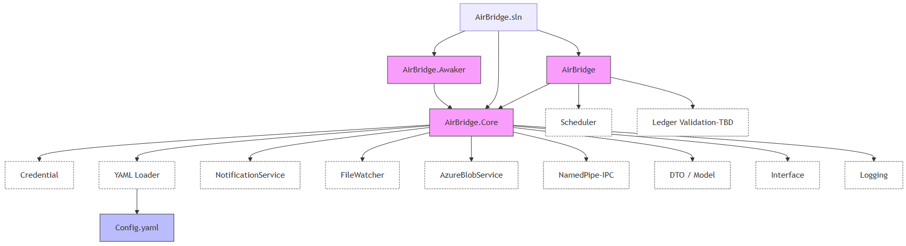

<style>
/* 기본 스타일 - 슬라이드에 맞는 최적화된 폰트 크기 */
.slide {
  font-size: 0.6em;
  line-height: 1.3;
  margin-top: 0.8rem;
  margin-bottom: 0.8rem;
}

.title-slide {
  text-align: center;
  padding: 2rem;
  border-bottom: 3px solid #2c3e50;
}

.title-slide h1 {
  font-size: 2rem;
  margin-bottom: 0.8rem;
}

.title-slide h2 {
  font-size: 1.1rem;
}

.section-header {
  border-left: 4px solid #3498db;
  padding-left: 1rem;
  margin-top: 0.6rem;
  margin-bottom: 0.6rem;
}

.section-header h2 {
  font-size: 1.2rem;
}

.content-box {
  background-color: #f8f9fa;
  border: 1px solid #e9ecef;
  border-radius: 8px;
  font-size: 0.7em;
  padding: 0.2rem;
  margin: 0.2rem 0;
}

.content-box h3 {
  font-size: 1rem;
  margin-bottom: 0.8rem;
}

.content-box ul {
  margin: 0.5rem 0;
}

.content-box li {
  margin: 0.3rem 0;
}

.code-block {
  background-color: #f1f3f4;
  border: 1px solid #dadce0;
  border-radius: 6px;
  padding: 0.8rem;
  font-family: 'Cascadia Code', 'Consolas', 'Monaco', monospace;
  font-size: 0.7em;
  margin: 0.8rem 0;
}

.architecture-box {
  background-color: #e8f4fd;
  border: 1px solid #b3d9ff;
  border-radius: 8px;
  font-size: 0.7em;
  padding: 1.2rem;
  margin: 0.8rem 0;
}

.architecture-box pre {
  font-size: 0.75em;
  margin: 0.5rem 0;
}

.improvement-box {
  background-color: #fff3cd;
  border: 1px solid #ffeaa7;
  border-radius: 8px;
  font-size: 0.6em;
  padding: 0.4rem;
  margin: 0.4rem 0;
}

.improvement-box h4 {
  font-size: 1.2rem;
  margin-top: 0.4rem;
  margin-bottom: 0.4rem;
}

.tech-stack-box {
  background-color: #d1ecf1;
  border: 1px solid #bee5eb;
  border-radius: 8px;
  font-size: 1rem;
  padding: 0.6rem;
  margin: 0.6rem 0;
}

.tech-stack-box h3 {
  font-size: 1.3rem;
  margin-top: 0.6rem;
  margin-bottom: 0.6rem;
}

.tech-stack-box ul {
  margin: 0.5rem 0;
}

.tech-stack-box li {
  margin: 0.3rem 0;
}

h3 {
  font-size: 1.3rem;
  margin-top: 0.4rem;
  margin-bottom: 0.4rem;
}

h4 {
  font-size: 1.1rem;
  margin-top: 0.4rem;
  margin-bottom: 0.4rem;
}

ul {
  margin: 0.4rem 0;
}

li {
  margin: 0.2rem 0;
}

p {
  margin: 0.4rem 0;
}
</style>

<div class="title-slide">

# 🚀 heygent
## 원장 중계 서버 개발 리뷰

</div>


---

## 목차

1. **원장 중계 서버 개요**
   - 배경, 필요성, 역할
2. **주요 기능**
3. **애플리케이션 아키텍처**
4. **코드 리뷰**
5. **Live Demo**
6. **앞으로의 개발 계획**
   - 원장 데이터 검증
   - 데이터 품질 웹 포털

---

<div class="section-header">

#### 1. 원장 중계 서버 개요

</div>

##### 배경 및 필요성

- **파일 동기화 자동화**: 다양한 소스에서 파일을 주기적으로 동기화
- **알림 시스템**: 동기화 상태 및 오류에 대한 즉시 알림
- **확장성**: 다양한 저장소 및 알림 채널 지원

##### 역할

- **중계 서버**: 소스와 타겟 간의 데이터 전송 중계
- **파일 검증**: 파일 유효성 및 무결성 검사
- **스케줄링**: Cron 기반 정기 작업 실행
- **로깅**, **알림**: 모든 작업에 대한 상세한 로그 기록 및 알림 서비스

---

<div class="section-header">

#### 2. 주요 기능

</div>

<div class="content-box">

##### 1. Cron 기반 스케줄링
- Cronos 라이브러리를 활용한 유연한 스케줄 설정
- 다중 백그라운드 스케줄 지원 및 타임존 설정

##### 2. 파일 감시 시스템
- 폴링 기반 파일 모니터링
- 파일 변경 감지 및 자동 처리

##### 3. 다양한 소스/타겟 지원
- 로컬 파일 시스템 (Linux, Windows 모두 커버)
- Azure Blob Storage (SFTP, SAS)

</div>

---

<div class="section-header">

#### 2. 주요 기능

</div>

<div class="content-box">

##### 4. 알림 시스템
- **Lark Webhook**: 실시간 팀 알림
- **Email**: 이메일 알림 지원
- **SMS**: 문자 메시지 알림
- **Factory Pattern**: 알림 채널 동적 선택

##### 5. 설정 관리
- YAML 기반 설정 파일
- 환경별 설정 분리

##### 6. 의존성 주입
- Microsoft.Extensions.Hosting 기반 DI 컨테이너
- 서비스 생명주기 관리

</div>


---

<div class="section-header">

#### 3. 애플리케이션 아키텍처

</div>

<div class="content-box">
- 단방향 데이터 흐름, 느슨한 결합 (Loose Coupling)<br>
- 확장 가능한 알림 시스템
</div>

<div class="architecture-box">

```
┌─────────────────┐    ┌──────────────────┐    ┌─────────────────┐
│   YAML Config   │    │  CronPolling     │    │   FileWatcher   │
│     Loader      │──▶│    Service       │──▶│                 │
└─────────────────┘    └──────────────────┘    └─────────────────┘
                                │                        │
                                ▼                        ▼
                       ┌──────────────────┐    ┌─────────────────┐
                       │  Notification    │    │   Azure Blob    │
                       │    Service       │──▶│     Service     │
                       └──────────────────┘    └─────────────────┘
                                │
                                ▼
                       ┌──────────────────┐
                       │ Lark/Email/SMS   │
                       │  Notifications   │
                       └──────────────────┘
```

</div>

---

<div class="section-header">

#### 3. 애플리케이션 아키텍처

</div>



---

<div class="section-header">

#### 3. 애플리케이션 아키텍처 - 설정 모델

</div>

<div class="content-box">
- 계층적 설정 구조<br>
- 타입별 설정 분리, 유연한 소스/타겟 설정
</div>

<div class="code-block">

```csharp
public class AppConfig {
    public ScheduleSection schedule { get; set; }
    public SourceSection source { get; set; }
    public TargetSection target { get; set; }
    public NotificationSection notification { get; set; }
    ... // omitted
}

public class ScheduleSection {
    public string[] cron_expression { get; set; }
    public string timezone { get; set; }
}

public class SourceSection {
    ... // omitted
}
```

</div>

---

<div class="section-header">

#### 3. 애플리케이션 아키텍처 - YAML 설정

</div>


---

<div class="section-header">

#### 3. 애플리케이션 아키텍처 - Dependencies

</div>


---

<div class="section-header">

#### 3. 애플리케이션 아키텍처 - Tech Stack

</div>

<div class="tech-stack-box">

#### .NET

- **.NET 8 (C# 12)** LTS (Long Term Support)

- **System.IO.Pipes (Named Pipe)**: IPC 기반 통신

#### OSS

- **Cronos** - Cron 표현식에 따른 background scheduling

- **Renci.SshNet** - SFTP client

- **YamlDotNet** - Yaml loader

- **Serilog**: 구조화된 로깅

</div>

---

<div class="section-header">

#### 3. 애플리케이션 아키텍처 - 작동 방식

</div>


---

<div class="section-header">

#### 4. 코드 리뷰 - 애플리케이션 진입점 (Program.cs)

</div>

<div class="content-box">
- Serilog 로깅 통합
</div>

<div class="code-block">

```csharp
Log.Logger = new LoggerConfiguration()
    .MinimumLevel.Information()
    .WriteTo.Console(
        outputTemplate: "{Timestamp:yyyy-MM-dd HH:mm:ss.fff} [{Level:u4}] {Message:lj}{NewLine}{Exception}"
    )
    .WriteTo.File(
        path: "logs/heygent-.log",
        rollingInterval: RollingInterval.Day,
        outputTemplate: "{Timestamp:yyyy-MM-dd HH:mm:ss.fff} [{Level:u4}] {Message:lj}{NewLine}{Exception}",
        fileSizeLimitBytes: 50 * 1024 * 1024, // 50MB 초과하면 새 파일 생성.
        retainedFileCountLimit: 60,
        buffered: false // 즉시쓰기. 메모리 버퍼 최소화
    )
    .CreateLogger();
```

---

<div class="section-header">

#### 4. 코드 리뷰 - 애플리케이션 진입점 (Program.cs)

</div>

<div class="content-box">
- HostedService로 백그라운드 작업 관리<br>
- Factory Pattern을 통한 알림 서비스 생성
</div>

<div class="code-block">

```csharp
var host = Host.CreateDefaultBuilder(args)
    .UseSerilog()
    .ConfigureServices(services =>
    {
        services.AddSingleton<YamlConfigHelper>();
        services.AddHostedService<CronPollingService>();
        services.AddTransient<FileWatcher>();

        ... // omitted

        // 알림 서비스 등록
        services.AddSingleton<INotificationSenderFactory, NotificationSenderFactory>();
        services.AddSingleton<NotificationService>();
    })
    .Build();
```

</div>

---

<div class="section-header">

#### 4. 코드 리뷰 - 스케줄링 서비스 (heygent CronPollingService)

</div>

<div class="content-box">
- 비동기 처리로 성능 최적화, 1분 간격으로 Cron 표현식 확인<br>
- 조건 만족 시 FileWatcher 실행
</div>

<div class="code-block">

```csharp
public class CronPollingService : BackgroundService
{
    private readonly ILogger<CronPollingService> _logger;
    private readonly IFileWatcher _fileWatcher;
    private readonly NotificationService _notifier;
    private List<CronExpression> _cronExpressions;
    private TimeZoneInfo _timeZone;

    protected override async Task ExecuteAsync(CancellationToken stoppingToken)
    {
        while (!stoppingToken.IsCancellationRequested)
        {
            ... // omitted
            await Task.Delay(TimeSpan.FromMinutes(1), stoppingToken);
        }
    }
}
```

</div>

---

<div class="section-header">

#### 4. 코드 리뷰 - FileWatcher (파일 감시 및 처리)

</div>

<div class="content-box">
- Interface Segregation Principle 적용<br>
- DTO를 통한 데이터 전달, 비동기 알림 처리
</div>

<div class="code-block">

```csharp
public class FileWatcher : IFileWatcher
{
    private readonly ILogger<FileWatcher> _logger;
    private readonly string _rootDirectory;

    public async Task InspectAllFiles()
    {
        var files = GetAllFiles();
        foreach (var file in files)
        {
            if (!IsAlreadyInspect(file) && IsValid(file))
            {
                var content = TryReadText(file);
                ... // omitted
                UpdateIsInspect(file);
            }
        }
    }
}
```

</div>

---

<div class="section-header">

#### 5. Live Demo

</div>

---

<div class="section-header">

#### 6. 앞으로의 개발 계획

</div>

##### 1) 원장 데이터 검증 (필요 시)

<div class="improvement-box">

## 필드 스키마 구조 검증
- **원장 유형별 스키마 정의**: 각 원장 타입에 맞는 필드 구조 검증
- **데이터 타입 검증**: 문자열, 숫자, 날짜 등 타입별 유효성 검사
- **필수 필드 검증**: 누락된 필수 데이터 감지 및 보고

## 헤더/레코드 비교 검증
- **일관성 검사**: 헤더 정보와 실제 데이터 레코드 간 일치성 확인
- **합계 검증**: 레코드 합계와 헤더 합계 비교
- **중복 데이터 검사**: 중복 레코드 감지 및 제거

</div>

---

<div class="section-header">

#### 6. 앞으로의 개발 계획

</div>

##### 2) 데이터 품질 웹 포털 (필요 시)

<div class="improvement-box">

## Wireframe 참고 (nxt-data-quality-web-v1) -> **https://nxt-data-quality-web-v1.vercel.app**
- **대시보드**: 실시간 동기화 상태 및 오류 현황
- **파일 모니터링**: 파일별 처리 상태 및 이력 조회
- **설정 관리**: 웹 기반 설정 변경 및 검증
- **알림 관리**: 알림 채널별 설정 및 테스트

## 주요 기능
- **실시간 모니터링**: WebSocket을 통한 실시간 상태 업데이트
- **로그 뷰어**: 구조화된 로그 검색 및 필터링
- **성능 메트릭**: 처리 시간, 성공률 등 성능 지표
- **사용자 권한**: 역할 기반 접근 제어

</div>

---

<div class="section-header">

#### References

</div>

<div class="architecture-box">

- ERP Index
https://nsgbpjpgygq3.sg.larksuite.com/docx/Xxbpd1ww6oJ1z6xhZGulXToWggf

- heygent 중계 서버 설계
https://nsgbpjpgygq3.sg.larksuite.com/docx/KLgqdH1cfoNlIrxUUKJld3qqgLc

- 넥스트증권_MS ERP 시스템 구축_연동시스템_Rev0.1.pptx
https://nsgbpjpgygq3.sg.larksuite.com/file/JHeObx1IEo7rzhxVoRGlClqfgtg

- ERP신규시스템  MSP RFP
https://nsgbpjpgygq3.sg.larksuite.com/docx/J4rddSfhuo5BUDxkYN9lTg4dgSh

- [별첨] 7주차_주간보고_분개룰_Interface Layout_250801
https://nsgbpjpgygq3.sg.larksuite.com/sheets/IdIBs0jnbhHCtmtplvvl6Q4VgNh?sheet=10tuLJ

</div>

---

<div class="section-header">

## 경청해주셔서 감사합니다.

</div>

<br>

🧐 **질문 및 토론**

    - 인프라 스트럭처에 대한 논의
    - 개선 사항 토론
    - 기술적 구현 방법 논의
    - 향후 발전 발향 협의

<br>
<br>

`eof`